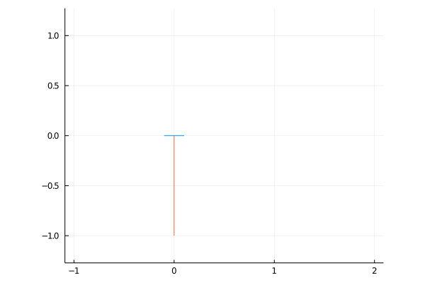
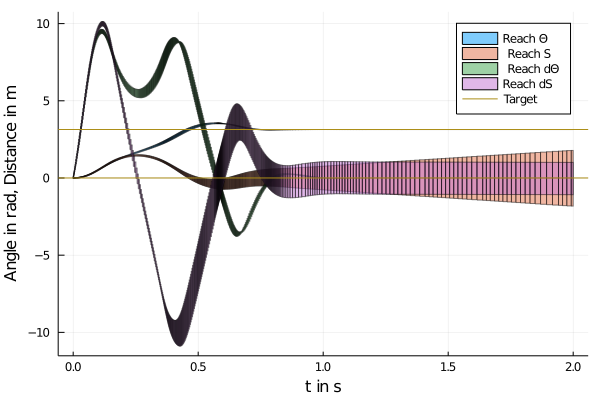
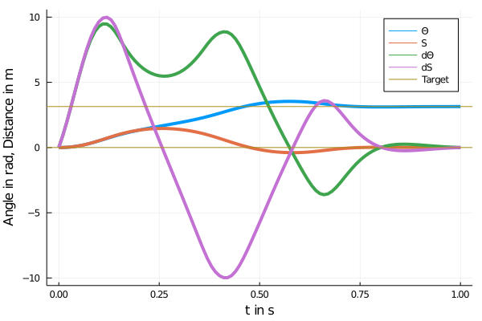

# Verification of a neural network controlled non-linear system

### An animation of an neural network controlled cart pole that is trained to swing up

### The results of the reachability analysis over two seconds

In the following the code will be explained, to get to the above graphics. Julia 1.6 was used.

    using Flux
    using ReachabilityAnalysis
    using Plots
    using DifferentialEquations
    using BSON
    using DiffEqFlux
    using DiffEqSensitivity
    using Optim

Defining some constants, like the length and the masses of the cartpole 

    M = 1.
    m = 1.
    L = 1.
    g = 9.81

Defining the differential equations for a cart pole, which is force controlled.

    function cartpoleC(du,u,p,t)
        # theta, s, dtheta, ds = u[1:4]

        F = reC(p)([sin(u[1]) , cos(u[1]), u[3]])[1]
        
        du[1] = u[3]
        du[2] = u[4]
        du[3] = -((M+m)*g*sin(u[1])+m*L^2*sin(u[1])*cos(u[1])*u[3]^2+F*L*cos(u[1]))/(M+m-m*cos(u[1])^2)L^2
        du[4] = -(m*L*sin(u[1])*u[3]^2 + m*g*sin(u[1])*cos(u[1])+F*L)/(M+m-m*cos(u[1])^2)*L
        
        return nothing
        
    end

Where reC(p) gives the neural network defined as:  

    nnC = Chain(Dense(3,32, tanh), Dense(32,1) )
    p, reC = Flux.destructure(nnC)

Defining the initial condition for training (cart at zero position, pole facing down, velocities zero):

    x0 = zeros(4)

Defining the function for obtaining the values of the solution of the system depending on the parameters given to the network:

    predictC(theta) = Array(DifferentialEquations.solve(ODEProblem(cartpoleC, x0, t_span),Tsit5(),p = theta,saveat=Δt, sensealg=ReverseDiffAdjoint()))

Defining the loss function which penalizes deviations from the zero position of the cart and deviations from the pole standing upright:

    function lossC(theta)

        pr = predictC(theta)
        # theta, dtheta

        loss = 10*sum(abs2,(3.14 .- pr[1,end])) + 0.6*sum(abs2,(pr[2,end]))

    end

Defining the time span in which the system will be trained and the time step:

    t_span = (0., 1.)
    Δt = 0.01

Defining a callback function for showing the loss values:

    callback = function (p, l)
    
        display(l)

        return false
        
    end

Having a look at the loss with the initial parameters:

    lossC(p)

First, training the network with an ADAM-optimizer:

    res1 = DiffEqFlux.sciml_train(lossC, p, Flux.ADAM(.1),  maxiters=100, cb = callback)

How did the loss improve?

    lossC(res1.u)

Switching to a Quasi-Newton solver 

    res2 = DiffEqFlux.sciml_train(lossC, res1.minimizer, BFGS(initial_stepnorm = 0.01),  maxiters = 150, allow_f_increases = true, cb = callback)

The loss can further be altered (punishing more velocities at the end) and minimized by more optimization steps

Different loss definition:

    function lossC(theta)

        pr = predictC(theta)
        # theta, dtheta

        loss = 10*sum(abs2,(3.14 .- pr[1,end])) + 0.6*sum(abs2,(pr[2,end])) + 1*sum(abs2,(pr[3,end])) + 1*sum(abs2,(pr[4,end]))   
    end

res3 = DiffEqFlux.sciml_train(lossC, res2.minimizer, BFGS(initial_stepnorm = 0.01),  maxiters = 150, allow_f_increases = true, cb = callback)

    lossC(res4.u)

Plot of ODE-solution with very low loss:

    plot(t_span[1]:Δt:t_span[2], predictC(res4.u)')
    hline!([pi,0])

Now we can verify the behavior of the system with the package ReachabilityAnalysis.jl \
Therefore we redefine the differential equation of the cartpole to use the already trained weights (res4.u).

function cartpoleCV(du,u,p,t)
    # theta, s, dtheta, ds = u[1:4]

    F = reC(res4.u)([sin(u[1]) , cos(u[1]), u[3]])[1]
    
    du[1] = u[3]
    du[2] = u[4]
    du[3] = -((M+m)*g*sin(u[1])+m*L^2*sin(u[1])*cos(u[1])*u[3]^2+F*L*cos(u[1]))/(M+m-m*cos(u[1])^2)L^2
    du[4] = -(m*L*sin(u[1])*u[3]^2 + m*g*sin(u[1])*cos(u[1])+F*L)/(M+m-m*cos(u[1])^2)*L
    
    return nothing
    
end

Then defining an initial set rather vector:

    U0 = Hyperrectangle(zeros(4), ones(4) .* 0.01)

Defining the initial value problem for the reachbility analysis:

    ivp_cartpole = @ivp(u' = cartpoleCV(u), dim=4, u(0) ∈ U0)

Solving the problem and the overapproximating the flow pip with zonotopes:

    sol_cartpole = ReachabilityAnalysis.solve(ivp_cartpole, (0.0, 2.0));
    zsol_cartpole = overapproximate(sol_cartpole, Zonotope);

Plotting gives the above result:

    p2 = plot(zsol_cartpole, vars=(0,1), label="Reach Θ")
    plot!(zsol_cartpole, vars=(0,2), label = " Reach S") 
    plot!(zsol_cartpole, vars=(0,3), label = " Reach dΘ")  
    plot!(zsol_cartpole, vars=(0,4), label = "Reach dS")
    hline!([pi,0], label = "Target", xlabel="t in s", ylabel = "Angle in rad, Distance in m" )

